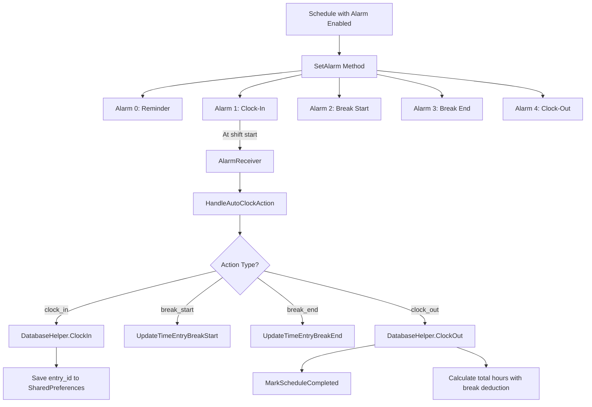

# ✅ Auto Clock-In/Out Feature - Implementation Complete

## 🎯 Overview

Your OJT InternTrack app now has **automatic time tracking** based on scheduled shifts! The system will:

- ⏰ **Auto clock-in** when your shift starts
- ☕ **Track break times** automatically
- ✅ **Auto clock-out** when your shift ends
- 📊 **Automatically mark schedules as completed**

---

## 🔧 How It Works

### Alarm System (5 Types)

When you enable an alarm for a schedule, the system now creates **5 different alarms**:

| #     | Alarm Type  | Timing                    | Action                | Purpose                                            |
| ----- | ----------- | ------------------------- | --------------------- | -------------------------------------------------- |
| **1** | Reminder    | Before shift (e.g., 5min) | 🔔 Notification only  | Warns you shift is starting soon                   |
| **2** | Clock-In    | Exact shift start time    | ⏱️ **Auto clock-in**  | Automatically starts tracking your hours           |
| **3** | Break Start | At break time             | ☕ Marks break start  | Records when your break starts                     |
| **4** | Break End   | When break ends           | 🔙 Marks break end    | Records when you resume work                       |
| **5** | Clock-Out   | Exact shift end time      | ⏹️ **Auto clock-out** | Automatically stops tracking and saves total hours |

---

## 📱 User Experience

### Example Timeline

Imagine you have a shift scheduled for:

- **Start**: 8:00 AM
- **Break**: 12:00 PM - 1:00 PM
- **End**: 5:00 PM
- **Alarm**: 5 minutes before

Here's what happens automatically:

```
7:55 AM → 🔔 Notification: "Shift Starting Soon"
8:00 AM → ✅ AUTO CLOCK-IN → Time tracking starts
12:00 PM → ☕ Break Start → Break time recorded
1:00 PM → 🔙 Break End → Resume work tracking
5:00 PM → ⏹️ AUTO CLOCK-OUT → Session saved, schedule marked complete
```

**Total Hours Calculated**: 8 hours (with 1-hour break automatically deducted)

---

## 🗂️ Technical Implementation

### Database Changes

**Version 9** - Added break time tracking to `time_entries` table:

- `break_start_time` (DATETIME) - When break started
- `break_end_time` (DATETIME) - When break ended

### New Methods

#### DatabaseHelper.cs

```csharp
// Track break times
UpdateTimeEntryBreakStart(entryId, DateTime)
UpdateTimeEntryBreakEnd(entryId, DateTime)

// Mark schedule as completed
MarkScheduleCompleted(scheduleId)
```

#### AlarmReceiver.cs

```csharp
// Handles auto-clock actions based on alarm type
HandleAutoClockAction(context, actionType, userId, location, scheduleId)
// Action types: "clock_in", "break_start", "break_end", "clock_out"
```

#### ScheduleActivity.cs

```csharp
// Creates 5 alarms per schedule
SetAlarm(schedule)
// Each with different actionType and minutesBefore
```

---

## 🎨 What the User Sees

### In the Schedule Screen

When you view today's shift, you'll see:

- **Before shift**: "Shift Starting Soon" reminder notification
- **During shift**: "ACTIVE WORK SESSION" with real-time duration
- **After shift**: Schedule automatically marked as completed ✓

### In Time Tracking

Your time entries now automatically include:

- Clock-in time (auto-recorded)
- Clock-out time (auto-recorded)
- Total hours (auto-calculated with break deduction)
- Notes: "Auto clock-in from scheduled shift" / "Auto clock-out from scheduled shift"

---

## 🔒 Smart Safeguards

The system includes intelligent checks:

1. **No Duplicate Clock-Ins**: Won't clock in if you're already clocked in
2. **Past Time Check**: Won't set alarms for times that already passed
3. **Schedule Completion**: Auto-marks schedule as done after clock-out
4. **Persistent Storage**: Remembers active entry ID in SharedPreferences
5. **Break Tracking**: Accurately tracks break duration for hour calculations

---

## 🚀 How to Use

### Enable Auto-Clock for a Schedule

1. Go to **Schedule** screen
2. View today's shift (or upcoming shift)
3. **Toggle the alarm switch ON** ✅
4. That's it! The system will handle the rest automatically

### Disable Auto-Clock

1. Toggle the alarm switch **OFF**
2. All 5 alarms will be cancelled
3. You'll need to manually clock in/out

---

## 📊 Data Flow Diagram



---

## 🎯 Benefits

✅ **No Manual Tracking**: Never forget to clock in or out  
✅ **Accurate Hours**: Breaks are automatically deducted  
✅ **Complete History**: All shifts auto-logged in timesheet  
✅ **Progress Tracking**: Dashboard automatically updates with real hours  
✅ **Peace of Mind**: System works even if you're busy

---

## 🧪 Testing Recommendations

1. **Create a test schedule** for 2 minutes from now
2. **Enable the alarm**
3. **Wait for auto clock-in** notification
4. **Check Time Tracking** screen - should show active session
5. **Check Dashboard** - should show real-time hours updating
6. **Wait for auto clock-out** (or create another test with short duration)
7. **Verify** completed hours in Timesheet

---

## ⚙️ Advanced Configuration

### Alarm Timing

- Default reminder: **5 minutes before** shift
- Can be customized per schedule in alarm settings

### Break Times

- Configured per schedule
- Default: 12:00 PM - 1:00 PM (1 hour)
- Automatically deducted from total hours

### Permissions Required

- ✅ `SCHEDULE_EXACT_ALARM` - For precise timing
- ✅ `POST_NOTIFICATIONS` - For alarm notifications
- ✅ `WAKE_LOCK` - To wake device for alarms
- ✅ `VIBRATE` - For alarm feedback

---

## 🔮 Future Enhancements

Potential improvements:

- [ ] Overtime tracking (if work beyond scheduled end time)
- [ ] Location-based auto clock-in (geofencing)
- [ ] Manual override options
- [ ] Smart reminders if you miss clock-in
- [ ] Weekly summary notifications

---

## 📝 Notes

- All auto-clock actions trigger background notifications (toast messages)
- Times are recorded to the second for accuracy
- Database automatically migrates to version 9 on first run
- Existing schedules work seamlessly with new system

---

**Implementation Date**: January 6, 2026  
**Database Version**: 9  
**Feature Status**: ✅ Complete and Ready to Use
